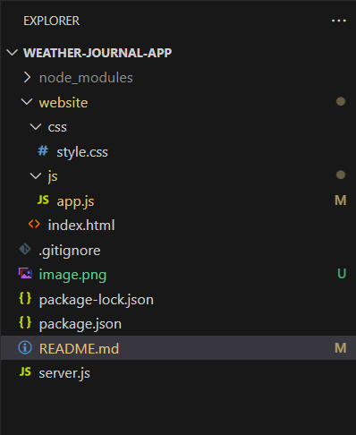

# Project Title
 ### Weather Journal Application
# Installation
 1. You need to download source code and open quickly with visual studio code.
 2. Ensure you install node and npm before.
 3. Type command in terminal visual studio code: npm install
# Table of Contents

- [Project Title](#project-title)
- [Installation](#installation)
- [Table of Contents](#table-of-contents)
- [About project](#about-project)
- [Use project](#use-project)

# About project
 - Website with support Javascript library to create asynchronous data in website.
 - Version project use:
  + Nodejs: v16.20.2
  + npm: 8.19.4

# Use Project
Prerequisites: Open source code at WEATHER-JOURNAL-APP in VS code like below:

1. Open terminal and start server file: **node server.js**
2. Open **index.html** at website folder
3. At zip code input: ensure typing valid zip code.
4. Open devtool --> click network tab to check API

If you are running server Nodejs in localhost: let's open chrome browser and type URL:
**http://localhost:3000/all** to check data coming from typing input and text-area